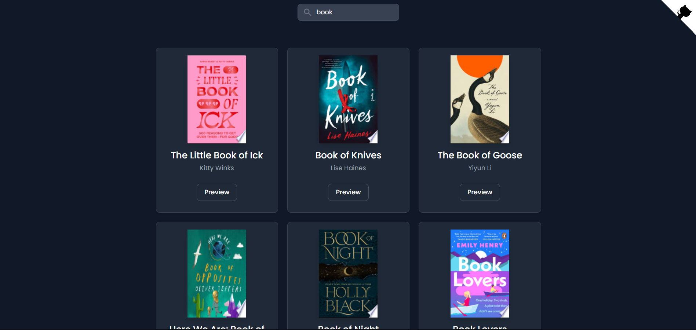

[PATİKA PROFILE URL](https://app.patika.dev/fatihdelice)

# Kitap Arama Uygulaması

Google Books API veya herhangi başka bir API ile kullanıcıların kitap veya yazar ismi yazarak kitap arayabileceği bir servis geliştirmeniz gerekiyor.

## Gereksinimler
- [ ] Input'a girilecek olan ifadeye uygun sonuçlar getirilmeli ve ekranda listelenmeli.
- [ ] Arama sonuçları sadece ilgili form submit edildiğinde gösterilmeli.
- [ ] Sonuçlarda kitapların kapak fotoğrafları bulunmalı.
- [ ] Kitap listesinde "detay" adında bir buton olmalı ve bu butona tıklandığında kitap ile alakalı detay bilgiler verilmeli (sayfa sayısı, yayın tarihi vs.) Detay bilgilerini farklı bir sayfada da gösterebilirsiniz, bir modal açtırarak da gösterebilirsiniz.

## Screenshot
